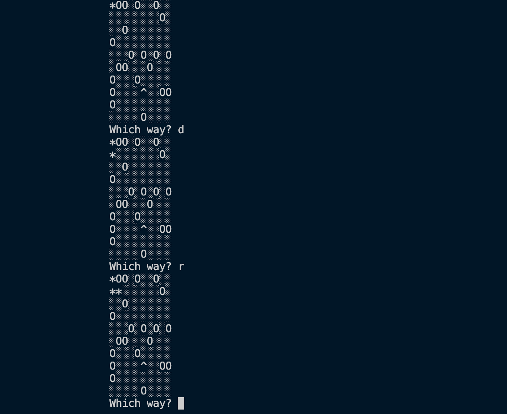

# Find Your Hat - JS Terminal Game

## Table of Content
* General Information
* Technologies Used
* Features
* Screenshot
* Installation and Setup Instructions
* Usage
* Project Status
* Room for Improvement
* Acknowledgements
* Contact

## General Information
I created this user interactive terminal game to display what can be done with JS and NodeJS.

### Purpose of this project
For Educational purposes.

## Technologies Used
* NodeJS
* NPM
* Javascript

## Features
* User prompts
* Simple game design

## Screenshot
Game Display 

## Installation and Setup Instructions

Clone down this repository. You will need node and `npm` installed globally on your machine.

### Installation:

`npm install`

To Run Game:

`node main.js`

## Usage

**User Input**

* Follow the prompt directions. Insert 'U', 'D', 'L', or 'R', and follow your character the '*' towards the hat '^' symbol while avoiding holes '0'. Note that you start at the top left.

## Project Status
Project is: Completed

## Room for Improvement
* Make hard mode with more holes.
* Make user start at a random location.

## Acknowledgements
* Many thanks to Codecademy.

## Contact
Created by Abeer Ahmed [LinkedIn profile](https://www.linkedin.com/in/abeerdev/) - feel free to contact me.

